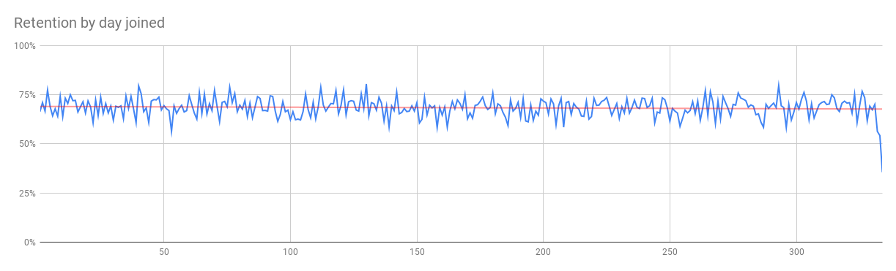
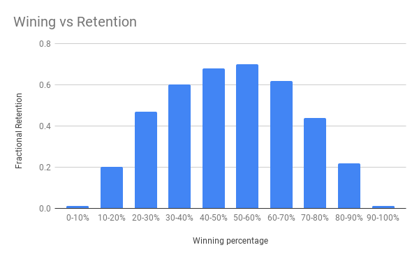

# SQL Data Analytics Project

This project was for a game company, the goal of my team (Maria-Elena Froese and Kelly Spencer) was to investigate player retention. Our metric was whether a player played a match 30 days after joining the game. We had four tables: to record players, to record matches, to record purchases, to record an inventory of game items to sell. Our first question was how to link players to matches, then our second question was how to identify whether players played after 30 days of joining the game.

We inspected the schema of the tables players and matches and we found out that we could link them by a common attribute (player_id). We decided to join those tables and to add a new column. In the new column we added "1" if the player had played after 30 day of joining the game or "0" in not. We identified the last day they played from the table matches to make this computation. Creating the new column with 1 or 0 was convenient to compute the number of players that played after 30 days. Then we proceeded to compute the fractional retention by adding all the players retained and dividing them by the number of players that joined by day.

We also tried a few other queries very similar to the one one described above with small changes to group the results by age and location. We brought the resulting data into google sheets to create charts to depict fractional retention by day joined, by age, and by location. In all there cases the data shows that the the game company has a stable retention rate and that players are replaced by new ones as quickly as we lose them (see chart 1).

See dataset at https://docs.google.com/spreadsheets/d/1CybTgJMLNvjSHkEQmr6DhJ9F0a3OxF8XWnHcjRhF9gg/edit?usp=sharing

The main challenge we face was that neither my colleague or I were game players and it was a new domain we were not familiar with. We discussed our assumptions and by talking about our questions and concerns and going back to the schemas, the table data, and posing a few exploratory queries we were able to dissipate most of our questions. The few remaining questions were clarified with the client (Wes Chorney).

Our second challenge was that the data had very little variance and exploring the fractional retention from a number of metrics (day joined, age, location, and O.S.) yield to results that gave us little room to make recommendations to improve retention. Our very last attempt was to compare fractional retention to wining percentage and at this time our results were of high value. We aggregated the data into 10 buckets from players that won 0-10% of their games to players that won 90-100% of their games so that we could easily visualize the results and split each of those buckets into players who were retained and not retained after 30 days as depicted in chart 2.

See dataset at https://docs.google.com/spreadsheets/d/1QsjN90fOiwtrJcZzTGCokhxdALrCiC7SYZzqdRB2Tlg/edit?usp=sharing
